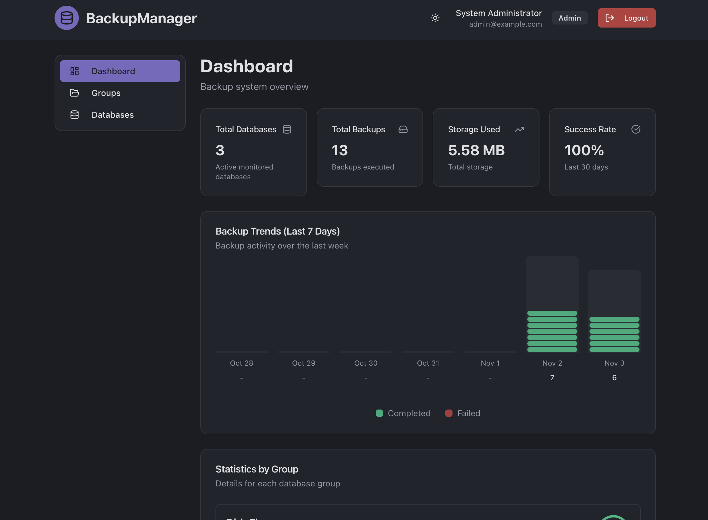

## What is BackupManager?

BackupManager orchestrates backups for databases and files with a FastAPI backend and a React (Vite) frontend, designed for multi-destination targets and integrated scheduling.

### Preview

